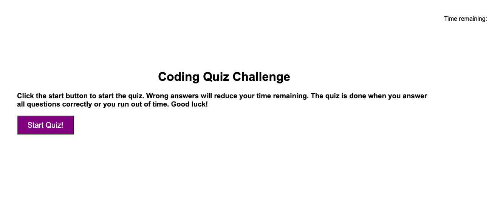

# Colin Code Quiz

## Description

This program is designed to help developers sharpen their coding skills.  You will be asked a series of questions.  At the end you will see your score and have an option to save your score and initials.  Good luck!

## Technologies Used

HTML, CSS, javascript, git, and jquery

## Usage

Load the website.  When you are ready click the start button.  The quiz will start.  You have 60 seconds to finish the test so work efficiently.  If you run out of time or finish all of the questions the quiz will end.

## User Story

* AS A coding boot camp student
I WANT to take a timed quiz on JavaScript fundamentals that stores high scores
SO THAT I can gauge my progress compared to my peers

## Acceptance Criteria

* GIVEN I am taking a code quiz
* WHEN I click the start button
* THEN a timer starts and I am presented with a question
* WHEN I answer a question
* THEN I am presented with another question
* WHEN I answer a question incorrectly
* THEN time is subtracted from the clock
* WHEN all questions are answered or the timer reaches 0
* THEN the game is over
* WHEN the game is over
* THEN I can save my initials and score

##Screenshot

## Credits

W3 schools tutorials and github for help and reference.

## Link to depolyed page

[Portfolio Webpage]( https://cpriyam90.github.io/First-Portfolio-Assignment/)